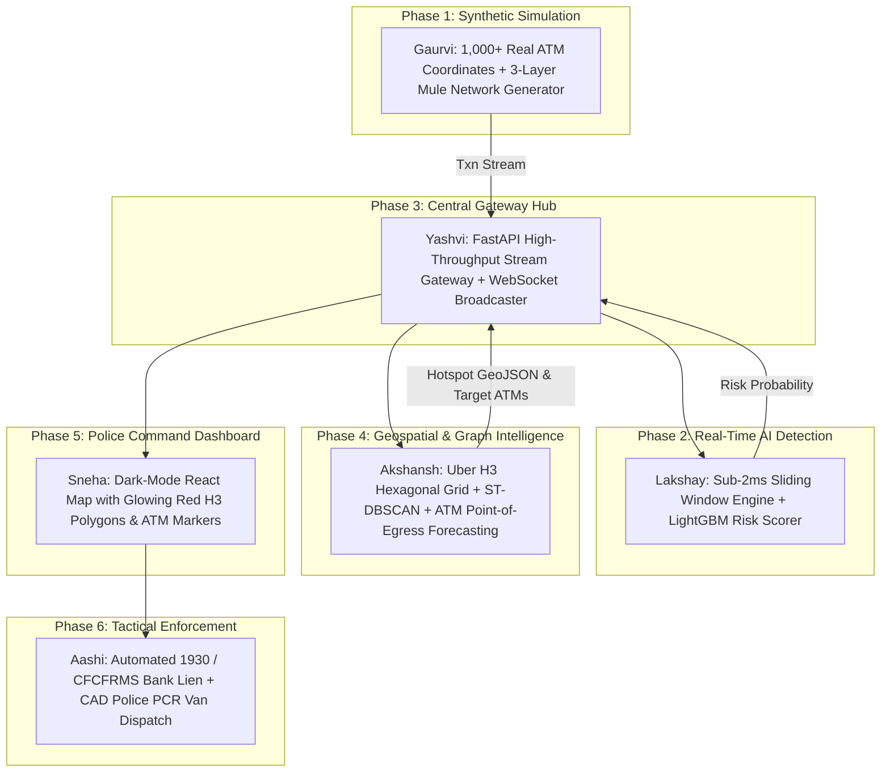

# 🛡️ Geo-CashWatch: Project Idea & Comprehensive Concept Note

**SIH Problem Statement ID:** SIH 26184  
**Title:** Predictive Analytics Framework for Cybercrime Cash Withdrawal Forecasting  
**Team Name:** Geo-CashWatch Core Team  
**Repository:** [lakshayverma2610/SIH26](https://github.com/lakshayverma2610/SIH26)  
**Branch:** `Graph-DB`  

---

## 📌 1. Executive Summary

**Geo-CashWatch** is an end-to-end predictive intelligence and tactical interception system designed for Cyber Crime Police Units, the Indian Cybercrime Coordination Centre (I4C), and Banking Fraud Control Centers. 

It converts **digital money laundering trails** (UPI smurfing, mule account chains, and rapid fund layering) into **physical, geographic cash-out predictions**. By combining real-time behavioral feature extraction, Uber H3 discrete global spatial indexing, and Spatio-Temporal Clustering (ST-DBSCAN), Geo-CashWatch forecasts **which neighborhood zone and which exact ATM kiosk** criminals will target **15 to 45 minutes before physical cash withdrawal takes place**.

```
[Digital Crime Trigger] ──> [AI Mule Scoring] ──> [H3 Geo Spatial Clustering] ──> [ATM Target Forecast] ──> [Police / Lien Action]
  UPI Scam / NCRP 1930        Sub-2ms Feature Extractor   Res 8/9 Hexagon Mapping       Nearest Kiosk & Time SLA   Patrol Dispatch & Freeze
```

---

## 🚨 2. The Problem: "The Cash-Out Cold Trail"

In modern cyber fraud (APK rat malware, fake trading apps, task-based scams, loan frauds):

1. **Rapid Fund Splitting (Layering):** Stolen money (e.g., ₹5,00,000) does not stay in one account; it is fragmented within seconds across 5 to 10 "mule accounts".
2. **Physical Point of Egress:** Within 30 to 45 minutes of the crime, mule runners are deployed to physical ATMs or AePS (Aadhaar Enabled Payment System) micro-merchants to withdraw cash bundles.
3. **The Enforcement Gap:**
   * Traditional banking anti-fraud systems flag transactions post-facto or in silos.
   * Cyber police can see digital transaction lines on a screen, but have **zero spatial visibility** into where in the city the physical cash withdrawal is about to occur.
   * By the time formal freeze requests reach banks (hours or days later), the cash is already gone, making recovery nearly impossible.

---

## 💡 3. The Core Solution: How Geo-CashWatch Works

Geo-CashWatch operates in 6 synchronized phases across 6 specialized roles:



---

## 🔬 4. Key Technological Innovations & USPs

### 1. Sub-2ms Sliding Window Behavioral Extractor
* Analyzes 1-minute and 5-minute outbound velocity ($V_1, V_5$), dormancy disruptions (>45 days inactive account suddenly receiving massive funds), and device/IP multiplexing.
* Operates in-memory with sub-2 millisecond latency to handle thousands of transactions per second.

### 2. Uber H3 Hierarchical Spatial Quantization
* Maps raw geographical coordinates to deterministic global hexagonal cells:
  * **Resolution 8 ($\approx 0.74\text{ km}^2$):** Neighborhood-level tactical containment zone.
  * **Resolution 9 ($\approx 0.10\text{ km}^2$):** Commercial street / ATM kiosk strip pinpointing.
* Generates closed-ring GeoJSON polygons for dynamic map rendering without heavy GIS database overhead.

### 3. Spatio-Temporal Clustering (ST-DBSCAN)
* Identifies spatial convergence ($1.0\text{ km}$ radius) and temporal convergence ($30\text{ min}$ rolling window) of multiple flagged mule accounts.
* Computes aggregate threat severity (`CRITICAL`, `HIGH`, `MEDIUM`) and total in-flight funds at risk.

### 4. Dynamic ATM Point-of-Egress Matching & Hawkes Process Decay
* Pre-indexes physical ATM and AePS kiosk terminals across city corridors.
* Evaluates proximity-weighted withdrawal probabilities and applies Hawkes process exponential decay ($\lambda = 0.05$) to establish a **critical 25-to-45 minute police intervention window**.

### 5. Automated Enforcement & Compliance (1930 / CFCFRMS)
* **Digital Freeze:** One-click API trigger to lock daily ATM debit limits across beneficiary accounts via the CFCFRMS framework.
* **Computer-Aided Dispatch (CAD):** Generates automated dispatch orders with Google Maps GPS turn-by-turn navigation for beat patrol units.
* **Statutory Reports:** Automatically compiles Section 91 CrPC and Section 65B Indian Evidence Act compliant Incident Action Reports (IAR).

---

## 👥 5. Team Roles & Architecture Mapping

| Team Member | Role Title | Module / Branch | Core Function |
| :--- | :--- | :--- | :--- |
| **Gaurvi** | *Data Architect & Pitch Lead* | `mock_data/` (`Mock-Data`) | Generates realistic banking graphs, 1000+ ATM points, and real-time attack stream simulator. |
| **Lakshay** | *AI/ML Detection Engineer* | `ai_engine/` (`AI-Engine`) | Builds the in-memory feature extractor and LightGBM mule classifier ($0.0 - 1.0$). |
| **Yashvi** | *Backend Core & Ingestion Engineer* | `backend/` (`Backend-Kafka`) | Central async FastAPI gateway, stream orchestrator, and WebSocket broadcaster. |
| **Akshansh (You)** | *Geospatial & Graph Architect* | `graph_db/` (`Graph-DB`) | Uber H3 grid mapping, ST-DBSCAN clustering, and physical ATM cash-out forecasting. |
| **Sneha** | *Frontend UI/UX Engineer* | `frontend/` (`Dashboard`) | Dark-mode command center with glowing H3 threat polygons, telemetry feed, and demo triggers. |
| **Aashi** | *Integration & Alert Systems Engineer* | `alerts_module/` (`Alerts`) | 1930 bank lien manager, police CAD dispatch router, and statutory report exporter. |

---

## 🎯 6. Real-World Impact & Target Users

1. **State Cyber Crime Cells & Police Control Rooms (PCR):** Real-time spatial radar to position PCR vans near vulnerable ATM strips before criminals arrive.
2. **Indian Cybercrime Coordination Centre (I4C - MHA):** Nation-wide integration with Citizen Financial Cyber Fraud Reporting System (CFCFRMS 1930 helpline).
3. **Banking Fraud Risk Management (FRM) Teams:** Automated micro-geofencing and dynamic ATM withdrawal throttle for high-risk accounts.

---

## 🎤 7. The 60-Second Pitch for Hackathon Judges

> *"Respected Judges, in financial cyber fraud, the biggest bottleneck is not just detecting the digital scam—it's stopping the physical cash from leaving the banking system. Within 30 minutes of a scam, mule runners withdraw physical cash from street ATMs, and the money vanishes forever.*
> 
> *Our solution, **Geo-CashWatch**, is a real-time predictive framework. When our AI flags suspicious fund velocity, our **Geospatial Engine** clusters active mule accounts into **Uber H3 hexagonal zones**, correlates them with physical ATM databases, and predicts the exact target kiosk and a **30-minute intervention window**.*
> 
> *This empowers law enforcement to dispatch a nearby patrol car or execute an automated 1930 banking lien **before the cash is withdrawn**."*
